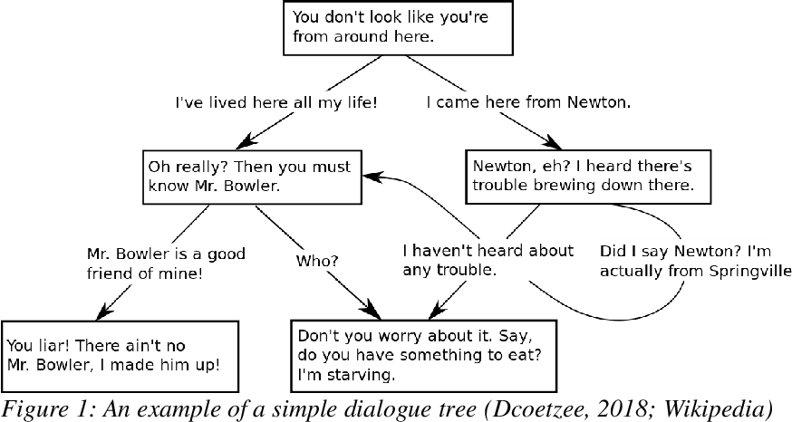

# Assignment: Text adventure
*PLEASE READ THIS **ENTIRE** DOCUMENT FIRST*

* [the assignment](#the-assignment)
* [submitting-your-work](#submitting-your-work)

## The assignment
 

* Create the local project as described [here in GitBook](https://cmd-viscom.gitbook.io/2-2-mmt5/opdrachten/4-cookies-and-storage#eindopdracht).
* Make sure that this website works on your local machine.

## Submitting your work
* Create a new branch called **gh-pages** and upload your local work into this branch.
* Start a new **pull request**, select one **reviewer** and make sure to put the **GitHub Pages URL** in the comment section.
* Do **not** merge this Pull Request yourself. That's up to the reviewer to decide (merging is approving the assignment).
